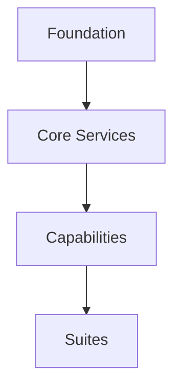
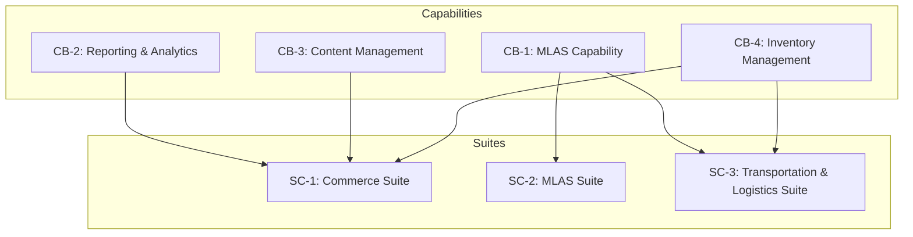
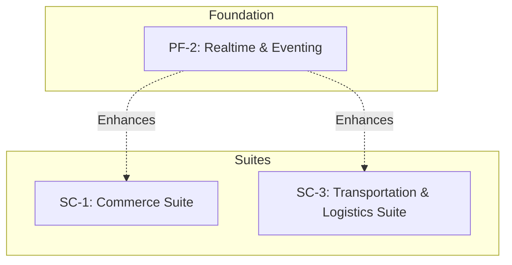
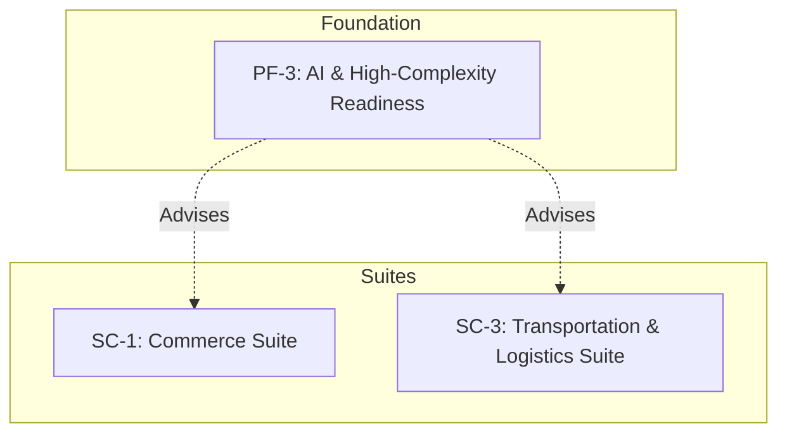
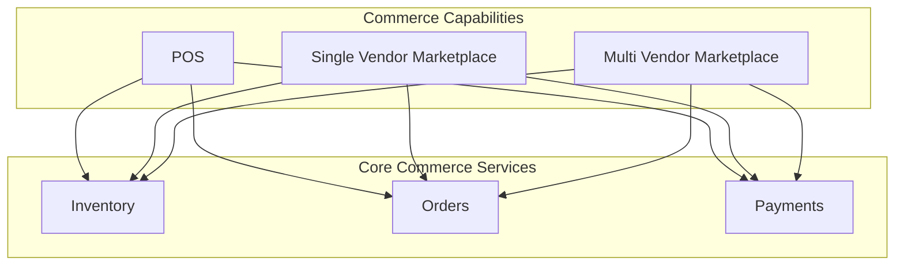

# WebWaka Capability Dependency Maps

**Version:** 1.0  
**Date:** January 30, 2026  
**Author:** Manus AI

---

## 1. Purpose

This document provides a clear, visual representation of the dependencies between different capabilities and suites within the WebWaka platform. It is designed to enforce architectural discipline and ensure that all development respects the platform's core invariants, particularly the Layered Dependency Rule (INV-004), and the optional, degradable nature of AI (INV-009) and Realtime (INV-010).

---

## 2. Core Principles

*   **Lower layers can never depend on higher layers.** (INV-004)
*   **Realtime is an optional, degradable capability.** No critical path may depend on it. (INV-010)
*   **AI is an optional, pluggable capability.** No critical path may depend on it. (INV-009)
*   **Capabilities are composable.** Suites are built by composing capabilities.

---

## 3. High-Level Dependency Map

This diagram shows the high-level dependencies between the major platform layers.

---

## 4. Detailed Capability & Suite Dependencies

This diagram illustrates the specific dependencies between suites and the capabilities they consume.

---

## 5. Realtime & AI as Optional Enhancements

Realtime (PF-2) and AI (PF-3) are foundational platform extensions, but they are treated as optional, pluggable capabilities that enhance suites without being critical dependencies. This is a core architectural principle.

### 5.1. Realtime Dependency Model

*   **Realtime enhances, it does not enable.**
*   **Graceful Degradation is Mandatory.**

| Suite | Realtime Enhancement | Graceful Degradation |
| :--- | :--- | :--- |
| **Commerce Suite** | Live inventory updates, order status notifications. | Falls back to periodic polling and async notifications. |
| **Transportation Suite** | Live seat availability, vehicle tracking. | Falls back to cached data and last-known locations. |

### 5.2. AI Dependency Model

*   **AI is decoupled from critical paths.**
*   **AI provides insights, not answers.**

| Suite | AI Enhancement | Decoupling Mechanism |
| :--- | :--- | :--- |
| **Commerce Suite** | Product recommendations, demand forecasting. | AI results are presented as suggestions, not hard rules. The suite functions perfectly without them. |
| **Transportation Suite** | Route optimization, dynamic pricing suggestions. | AI provides optimized routes and pricing, but the system can always fall back to default, static values. |

---

## 6. Composability of Commerce Capabilities

The Commerce Suite itself is a composition of smaller, independent capabilities (POS, SVM, MVM). This allows for maximum flexibility in deployment.

This model ensures that a client can deploy just a POS, just an SVM, or any combination of the three, and they will all share the same underlying commerce engine.

---

## 7. Support for Extreme Use Cases

The decoupled, composable, and flexible architecture defined in these maps is designed to support a wide range of future use cases without breaking the core invariants.

| Use Case | How It Is Supported |
| :--- | :--- |
| **InDrive-Style Negotiation** | This can be built as a new capability that leverages the Realtime (PF-2) and Pricing (INV-001) flexibility. It would not be part of the core transport suite, but an optional, add-on capability. |
| **Social/Community Platforms** | These can be built as new suites that consume core capabilities like Identity (CS-3), Content Management (CB-3), and MLAS (CB-1) for monetization. |

This approach ensures that the platform can evolve to meet new market demands without requiring a fundamental re-architecture.
